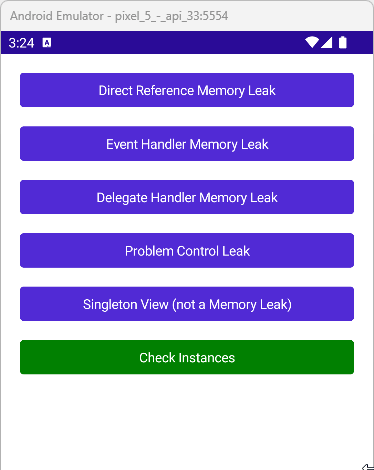

<!-- default badges list -->

<!-- default badges end -->
# Common .NET MAUI Memory Leaks and Their Fixes

This repository showcases common patterns that can lead to memory leaks in .NET MAUI applications. Each pattern is demonstrated on its own page, allowing you to test them individually.

For each page, we've included code that fixes the memory leak. You can uncomment this code to compare how the application behaves with and without the leak.

To see if a page remains in memory, click the **Check Instances** button. This triggers garbage collection and shows the number of kept pages.

You might need to click the **Check Instances** button 2-3 times to ensure the garbage collector clears unused objects over multiple cycles.

The example includes the following usage scenarios that can cause an object to remain in memory:

1. A reference from a long-lived object or static property
2. An event handler held by a long-lived object
3. A delegate function referenced by a long-lived object
4. A control with an internal memory leak on a page
5. A singleton view registered in the dependency injection container

## Find Memory Leaks

You can use [.NET Meteor](https://marketplace.visualstudio.com/items?itemName=nromanov.dotnet-meteor) and [Heapview](https://github.com/1hub/dotnet-heapview) to profile your .NET MAUI application. For more details, see the following blog post: [.NET MAUI Memory Profiling - Identify and Fix Memory Leaks](https://community.devexpress.com/blogs/mobile/archive/2024/08/21/net-maui-memory-profiling-identify-and-fix-memory-leaks.aspx)

If you'd prefer, you can also watch a step-by-step tutorial video on YouTube: [link](https://www.youtube.com/channel/UCtOjyugQSbxjQGuimGVsLVg)

## Files to Review

- [DirectReferenceLeakPage.cs](./CS/TypicalMemoryLeaks/Pages/DirectReferenceLeakPage.xaml.cs)
- [EventLeakPage.cs](./CS/TypicalMemoryLeaks/Pages/EventLeakPage.xaml.cs)
- [DelegateLeakPage.cs](./CS/TypicalMemoryLeaks/Pages/DelegateLeakPage.xaml.cs)
- [ControlLeakPage.cs](./CS/TypicalMemoryLeaks/Pages/ControlLeakPage.xaml.cs)
- [MauiProgram.cs](./CS/TypicalMemoryLeaks/MauiProgram.cs)

## Documentation

- [Create Your First App with DevExpress Mobile UI for .NET MAUI (Visual Studio Code)](https://docs.devexpress.com/MAUI/404815/get-started/build-your-first-app-vscode)

<!-- feedback -->
## Does this example address your development requirements/objectives?

 

(you will be redirected to DevExpress.com to submit your response)
<!-- feedback end -->
